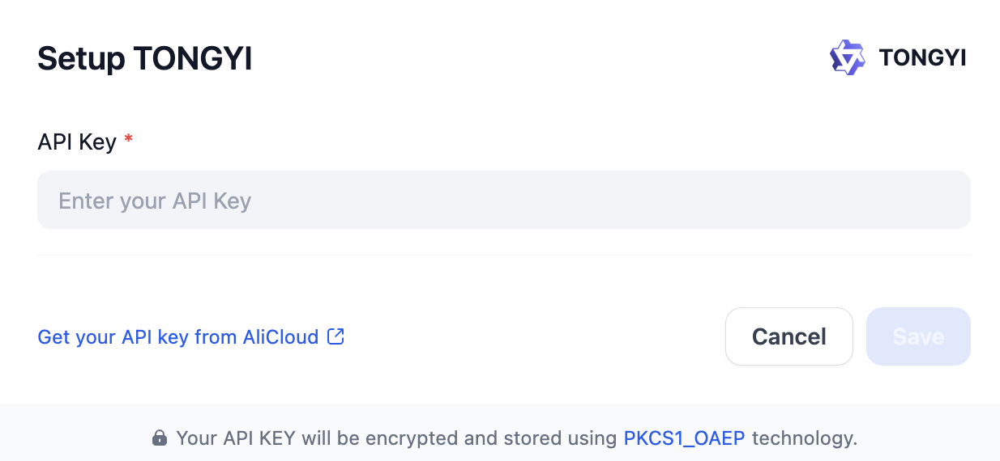

# Overview
Tongyi Qwen, developed by Alibaba Cloud, is a sophisticated series of LLMs. It includes multiple variants, such as Qwen for text processing, Qwen-VL for vision-language tasks, and Qwen-Audio for audio understanding. The models are notable for their impressive scale, with the flagship Qwen-72B model featuring 72 billion parameters and trained on over 3 trillion tokens.

# Configure
After installation, you need to get API keys from [Alibaba Cloud](https://bailian.console.aliyun.com/?apiKey=1#/api-key) and setup in Settings -> Model Provider.

# 安装说明
由于没有签名，因此需要修改dify的.env文件内容，添加/修改

> FORCE_VERIFYING_SIGNATURE=false

建议也修改pip源，避免插件依赖安装时间过长

> PIP_MIRROR_URL=https://pypi.tuna.tsinghua.edu.cn/simple

